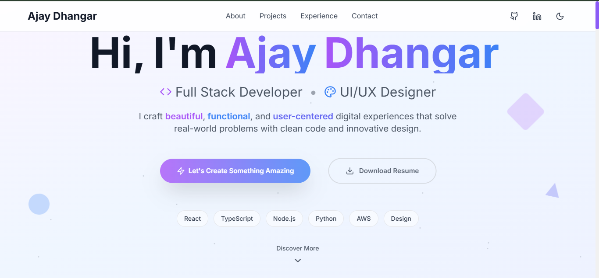

# 💼 Ajay Dhangar – Developer Portfolio (React + Vite + Tailwind)

A modern, high-performance, and fully responsive developer portfolio built using **React**, **TypeScript**, **Vite**, and **Tailwind CSS**.

## 🚀 Features

- 🖥️ Landing section with name, title & call-to-action
- 👨‍💻 About section with background & skills
- 🛠️ Skills section using styled cards/icons
- 📁 Projects showcase with GitHub/demo links
- 📬 Contact form with validation + social media
- 🌗 Light/Dark mode toggle (custom hook)
- 🔗 Sticky nav bar with smooth scroll
- 📱 Mobile-first responsive design
- 🎨 Minimal UI with animations (scroll-based)
- ⚡ Fast build using Vite

## 🛠️ Tech Stack

- React.js
- TypeScript
- Tailwind CSS
- Vite
- Custom Hooks (Dark Mode, Scroll Animations)

## 📂 Folder Structure

```
src/
├── components/
│   ├── About.tsx
│   ├── Contact.tsx
│   ├── Experience.tsx
│   ├── Footer.tsx
│   ├── Header.tsx
│   ├── Hero.tsx
│   └── Projects.tsx
├── hooks/
│   ├── useDarkMode.ts
│   └── useScrollAnimation.ts
├── App.tsx
├── main.tsx
├── index.css

```

## 🔗 Meta Tags & SEO

Implemented SEO-friendly meta tags including Open Graph for better social sharing visibility.  
**Deployed URL**: [https://ajay-dhangar.github.io/](https://ajay-dhangar.github.io/)

## 🌐 Live Preview

Check out the live demo of the portfolio: [Ajay Dhangar Portfolio](https://ajay-portfolio-react.vercel.app).

## 📷 Preview

> 

## 📬 Contact

Feel free to reach out on [LinkedIn](https://www.linkedin.com/in/ajay-dhangar/) or through the contact form on the website.